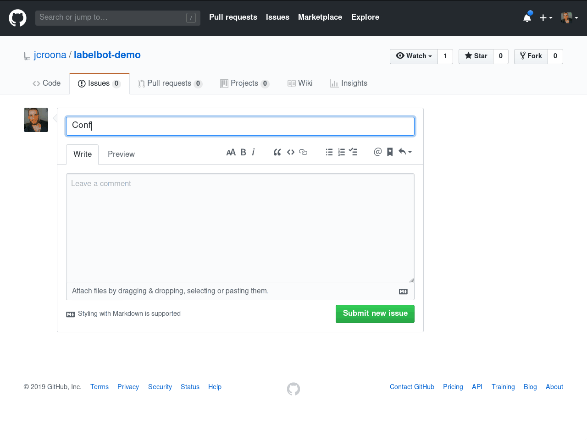

# Labelbot
[](https://travis-ci.com/slarse/labelbot)
[](https://codecov.io/gh/slarse/labelbot)


[](LICENSE)
[](https://github.com/ambv/black)



## Overview
Labelbot is a GitHub bot that sets labels on issues labels issues based on
markup in the issue body. The idea is to allow visitors without write access to
set one or more labels on the issue without a maintainer having to manually
intervene. Labelbot will only set a requested label if it is present in the
`.allowed-labels` file in the root of the project. This allows maintainers to
define a subset of labels that visitors can set. If the file is not present,
Labelbot will do nothing at all.

## Syntax
The markup syntax used in the issue body looks like this:

```
:label:`<REQUESTED_LABEL>`
```

`<REQUESTED_LABEL>` should be replaced with a requested label. For example, if
the requested label is `help`, the markup would look like:

```
:label:`help`
```

As `:label:` is (completely coincidentally) GitHub markup for a label symbol,
this will be rendered quite nicely in the web interface. There are no
restrictions upon where in the issue label markup is placed, or how many
labels are requested. Do however note that you need one `:label:` markup symbol
for each distinct label.

## Example
Assume that there is a `.allowed-labels` file with the following content:

```
question
feature request
formal complaint
help
```

A visitor can then open an issue with a body like this:

```
AWS lambda doesn't work, help me!

:label:`help` :label:`formal complaint`
```

The issue will then be labeled with `help` and `formal complaint`.
